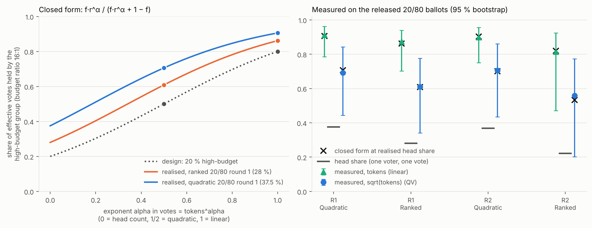
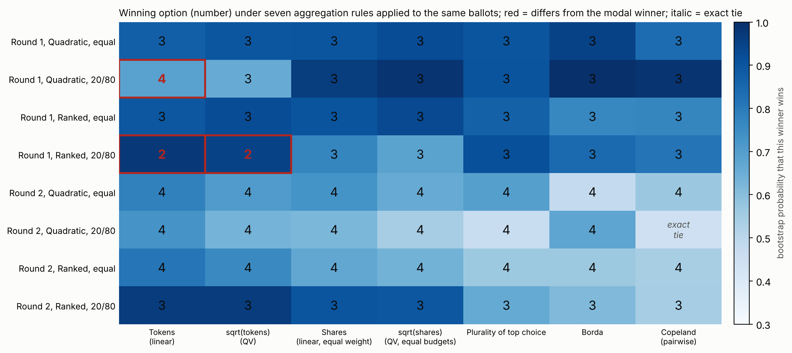
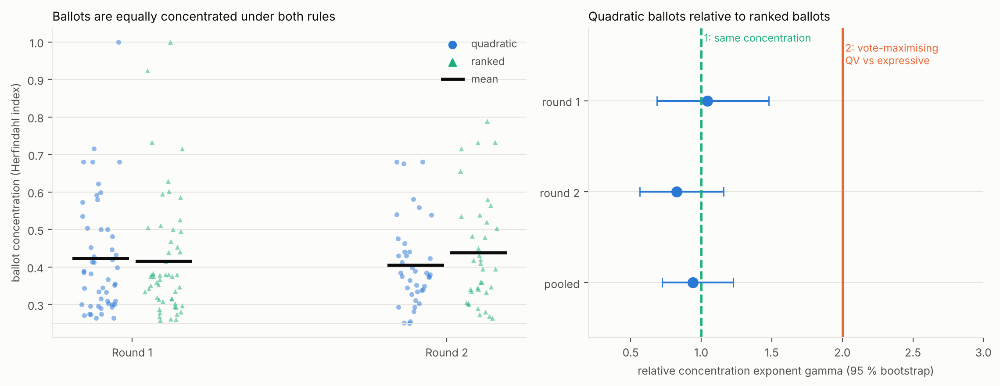
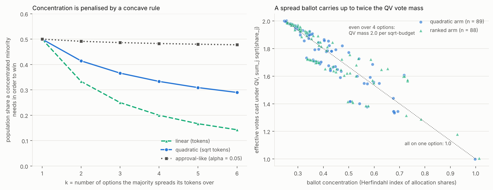
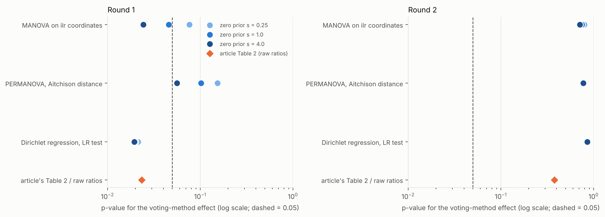
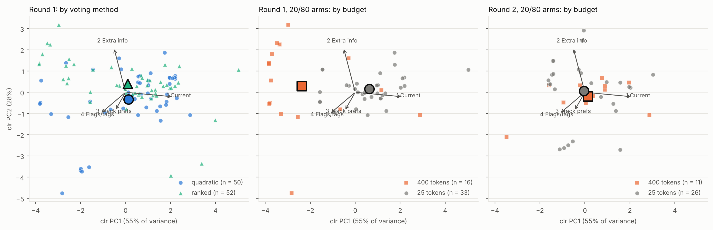
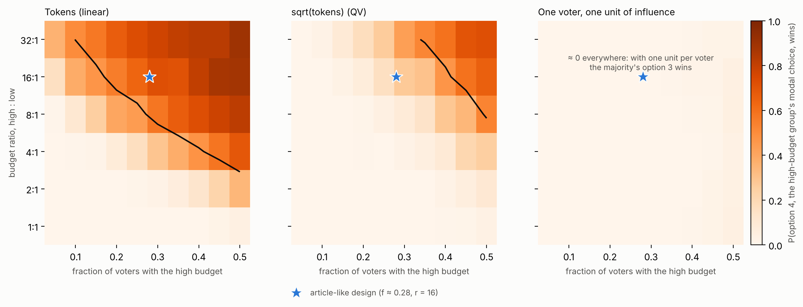
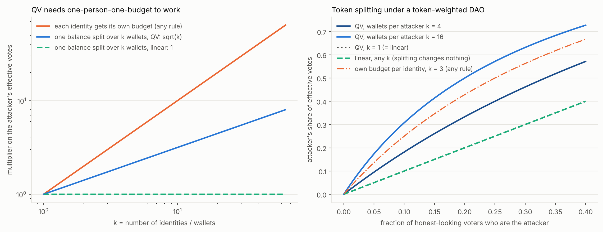
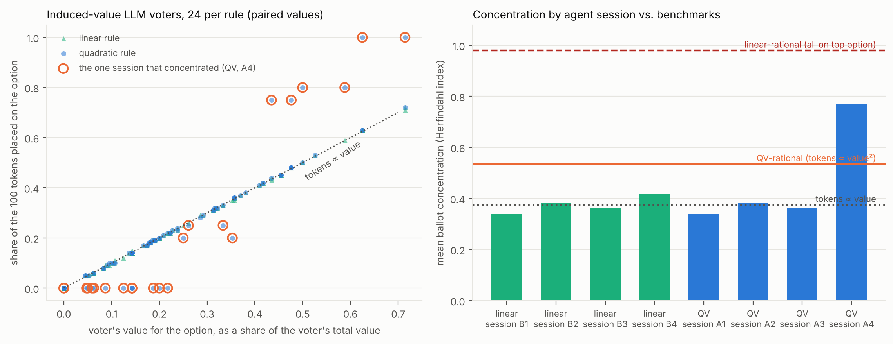

# 扩展分析：已发布选票在文章表格之外还能说明什么

[English](EXTENSIONS.md) | **简体中文**

本文全部是对已发布 OSF 数据的探索性分析，在 [REPRODUCIBILITY.zh-CN.md](REPRODUCIBILITY.zh-CN.md) 的复现之后补充。
它不属于文章的论断，也不是对文章结论的重新检验。样本格很小（每轮每个条件 18 到 27 人；共 177 人），下面的结果均未对分析数量做多重比较校正，
每项结果都依赖于紧邻处写明的假设。封闭形式的推导见 [THEORY.zh-CN.md](THEORY.zh-CN.md)。
代码：`scripts/run_extensions.py`（`python scripts\run_extensions.py`，约 75 秒；`--quick` 更快）。表格在 `results/extensions/tables/`。

| # | 问题 | 简短回答 |
|---|---|---|
| 1 | 各规则下高预算组获得多大权重？ | 占 token 的 81% 到 91%，占 sqrt 票的 56% 到 71%；与封闭形式吻合 |
| 2 | 同样的选票，赢家是否取决于聚合规则？ | 平等权力的格里不取决于；4 个 20/80 格里有 2 个取决于 |
| 3 | 二次规则下人们花 token 的方式不同吗？ | 选票集中度没有可检出的差异 |
| 4 | 在本设计中 QV 偏向集中的少数派吗？ | 理论上恰好相反，除非预算能在议题间转移 |
| 5 | 第 1 轮的投票方式效应在成分数据处理下稳健吗？ | 取决于检验方法；第 2 轮始终为零 |
| 6 | 高预算选民与低预算选民的分配不同吗？ | 第 1 轮差异很大，第 2 轮没有（据我所见，分组并非随机） |
| 7 | 其他设计会怎样？ | 以第 1 轮校准的蒙特卡洛相图 |
| 8 | LLM 投票者会随规则调整吗？ | 基本不会（小规模预实验，8 个会话） |

## 1. 权力压缩：封闭形式与数据

文章的 20/80 组让高预算组（400 token）比其余人（25 token）拥有大得多的权重。在已发布文件里，该组在第 1 轮为 49 人中的 16 人，
在第 2 轮为 37 人中的 11 人（各格 22% 到 37.5%），并非名义上的 20%。我无法从能读到的文章文字中确认分组是如何确定的
（我能读到的摘录只说 20% 的参与者获得 80% 的 token）。

| 格 | 高预算者占选民比例 | token 份额（95% 区间） | sqrt 票份额（95% 区间） | 封闭形式（sqrt 票） |
|---|---:|---:|---:|---:|
| 第 1 轮，quadratic 20/80 | 0.375 | 0.912（0.786 到 0.961） | 0.692（0.444 到 0.843） | 0.706 |
| 第 1 轮，ranked 20/80 | 0.280 | 0.874（0.703 到 0.939） | 0.610（0.342 到 0.776） | 0.609 |
| 第 2 轮，quadratic 20/80 | 0.368 | 0.899（0.750 到 0.957） | 0.705（0.435 到 0.861） | 0.700 |
| 第 2 轮，ranked 20/80 | 0.222 | 0.813（0.471 到 0.924） | 0.559（0.202 到 0.773） | 0.533 |

取平方根使高预算组份额下降 0.19 到 0.26，但所有点估计仍高于一半。把各格实际的人头占比代入封闭形式
（THEORY.zh-CN.md 命题 1），结果与实测值相差不超过 0.03。

## 2. 同样的选票，不同的聚合规则

对每个格的选票施加七种聚合器（token、sqrt token、等权份额、份额的平方根、首选项相对多数、Borda、Copeland），每格 2,000 次自助重抽样。
这里把选票视为在 quadratic 与 ranked 两个组之间可交换，第 3 节支持这一点，但无法证明。

* 在 4 个平等权力格以及第 2 轮 ranked 20/80 中，所有聚合器选出同一选项。第 2 轮 quadratic 20/80 中，六个聚合器选选项 4，Copeland 出现严格平局。
* **第 1 轮 ranked 20/80：**两个按 token 加权的规则（token、sqrt token）选选项 2（自助概率 0.98 与 0.95）；
  五个让每位选民等权或只用序数信息的规则都选选项 3（0.69 到 0.91，视规则而定）。这里取平方根并没有抵消 20/80 预算的影响。
* **第 1 轮 quadratic 20/80：**token 规则选选项 4（0.69）；sqrt token 及其他所有规则选选项 3（0.66 到 1.00）。
* 第 2 轮除 ranked 20/80 外的各格都很脆弱：赢家的自助概率为 0.46 到 0.81，20 个"规则-格"组合中有 19 个低于 0.8。

解读：赢家对规则敏感的来源是投票权力因素，而不是二次与线性之别。文章报告权力因素对 token 的花法影响不大；这里显示它仍可能影响最终决定。

## 3. 选票集中度不因规则而异

追求票数最大化的 QV 选民会按价值的平方分配 token；"表达式"选民按价值比例分配；追求票数最大化的线性选民会把全部压给一个选项（THEORY.zh-CN.md 第 4 节）。
所以如果人们对二次成本有反应，QV 选票应比 ranked 选票更集中。

| 轮次 | 赫芬达尔指数均值，quadratic | ranked | 差值（95% 区间） |
|---|---:|---:|---:|
| 1 | 0.423 | 0.416 | 0.007（-0.054 到 0.067） |
| 2 | 0.405 | 0.439 | -0.033（-0.095 到 0.025） |

quadratic 选票相对 ranked 选票的集中度指数合并后为 0.94（95% 区间 0.72 到 1.23）；该区间在两轮及合并后都排除 2，且包含 1。
第 1 轮的四个度量（赫芬达尔指数、最大份额、使用的选项数、QV 票质量）都通过了半个合并标准差的等价性检查；第 2 轮其中三个无定论（区间宽于边界）。
ranked 组赫芬达尔指数均值为 0.42 到 0.44，也排除了追求票数最大化的线性选民会表现出的角点行为。

假设：被试被随机分到各组；ranked 组可作为"表达式"基准；界面向被试展示了多少成本信息，我并不知道。

## 4. 凹规则偏向集中的少数派还是分散的多数派？

若比例 *pi* 的选民把全部 token 压在选项 A，其余人平均分给另外 *k* 个选项，则线性投票下 *pi* 超过 1/(1 + k) 时 A 获胜，
而 QV 下需超过 1/(1 + sqrt(k))（*k* = 2 时：33% 对 41%）。右图说明原因：分散到四个选项的选票，其 QV 票质量最多是集中选票的两倍；
在已发布选票上，平均质量为 1.75（范围 1.0 到 2.0），两个组相同。"QV 保护强烈偏好的少数"的直觉，需要选民能在更在乎的地方买更多票。
让预算在议题间流动的实验（Casella 与 Sanchez 2019，可存储投票与 QV；arXiv 2409.06614 中的固定预算多议题分析）才是合适的检验场景；
这个单一决策设计不是。

## 5. 成分数据重新分析

token 份额是成分数据。零值（39% 的选票至少有一个选项为 0）用贝叶斯乘法规则替换；检验使用等距对数比坐标。
投票方式效应的 p 值，并附文章自己的表 2 数值作参照：

| 检验 | 第 1 轮 | 第 2 轮 |
|---|---:|---:|
| 文章表 2（原始比例，Pillai） | 0.023 | 0.379 |
| ilr 坐标上的 MANOVA（零值先验 0.25 / 1 / 4） | 0.077 / 0.046 / 0.024 | 0.80 / 0.75 / 0.71 |
| Aitchison 距离上的 PERMANOVA | 0.154 / 0.102 / 0.056 | 0.77 / 0.76 / 0.78 |
| Dirichlet 回归，似然比检验 | 0.021 / 0.020 / 0.019 | 0.86 / 0.85 / 0.86 |

第 2 轮在任何处理下都没有效应。第 1 轮是否低于 0.05，取决于检验方法，前两种还取决于零值如何替换；Dirichlet 回归稳定在 0.02 左右。
我不会把第 1 轮的投票方式效应称为稳健。

## 6. 20/80 组内：高预算与低预算选民

在 Aitchison 距离上，第 1 轮高预算选民与低预算选民差异很大（伪 F 18.9，置换 p < 0.001，16 人对 33 人）：
高预算选民中 37.5% 把选项 4 作为首选，低预算选民只有 9%；低预算选民中 61% 首选选项 3。第 2 轮没有差异（伪 F 0.11，p 0.96；11 人对 26 人）。
据我所见分组并非随机（文章把高预算组描述为早期使用者），因此这描述的是高预算选民是怎样的一群人，
并不说明掌握权力改变了他们的想法。

## 7. 蒙特卡洛相图

选民的偏好从以第 1 轮 20/80 组校准的 Dirichlet 分布中抽取（高预算组平均份额 0.04 / 0.29 / 0.30 / 0.37，低预算组 0.14 / 0.21 / 0.42 / 0.22，精度 4.3），
按偏好比例花 token，再由聚合器计数。图中显示随着该组规模与预算比变化，高预算组最爱的选项（选项 4）获胜的概率。

预算比为 16:1 时，该概率在 token 规则下为 0.55（f = 0.20）到 0.72（f = 0.30），sqrt token 下为 0.07 到 0.27，每人计一次时为 0。
预算比为 4:1 时，token 规则下为 0.08 到 0.29，sqrt token 下至多 0.02。这是关于校准模型的陈述，不是关于参与者的陈述。

## 8. 女巫身份

把一份余额拆成 *k* 个钱包，QV 影响力乘以 sqrt(*k*)，线性影响力乘以 1；自带预算的身份在任何规则下都使影响力乘以 *k*（THEORY.zh-CN.md 第 3 节）。
因此第 1 节中的压缩只在"每人一份预算"时成立。这些是没有数据支撑的封闭形式；一篇预印本（Bennett 等，arXiv 2605.18990）报告了基于真实 DAO 代币分布的仿真，放大幅度很大。

## 9. LLM 投票者（小规模探索性预实验）

24 个诱导价值投票者（对四个选项的私人价值 0 到 10，100 个 token，两种规则下价值相同）由 Claude Haiku 智能体作答，每个会话 6 个投票者，每种规则 4 个会话。
没有模拟任何人口或身份属性。选票在 `data/silicon/pilot_ballots.csv`；`silicon.py` 负责构造提示词并分析，不调用任何模型。

在 24 个配对投票者中，18 个（每种规则 3 个会话）的分配完全相同或仅差 1 个 token，token 正比于价值（两种规则下对数-对数斜率中位数均为 1.02）；
线性规则下的智能体从未把全部 token 压给一个选项。有一个二次规则会话明显集中（赫芬达尔均值 0.77），超过了 QV 最优基准 0.53。
所以在这次预实验中，会话间的差异大于任何规则效应。这只说明某一模型家族在某一提示词下的行为，对人没有任何说明；
若要用作人类被试的替身，需要许多相互独立的会话。

## 未尝试的方向

只是想法，不是结果：允许策略性重新分配的固定预算多议题设计；对票做社交图加权
（Miller、Weyl 与 Erichsen 的 connection-oriented cluster match），以及 MACI 等抗共谋基础设施，作为第 8 节身份问题的应对；
把生成式社会选择（Fish 等，arXiv 2309.01291）用于 Human-AI 聊天消息；委托投票（liquid democracy，Kahng、Mackenzie 与 Procaccia，AAAI 2018）；
以及对每个提示词重复抽样的多会话 LLM 投票者实验。

## 延伸阅读（书目信息均已确认）

Collective Constitutional AI（Huang 等，FAccT 2024，arXiv 2406.07814）；AI 辅助协商（Tessler 等，*Science* 386(6719)，2024）；
社会选择与对齐（Conitzer 等，arXiv 2404.10271；Sorensen 等，ICML 2024，arXiv 2402.05070）；
模拟调查受访者（Argyle 等，*Political Analysis* 2023，arXiv 2209.06899）；
代币型 DAO 的投票权集中（Fritsch、Müller 与 Wattenhofer，*Blockchain: Research and Applications* 5(3)，2024；Feichtinger 等，arXiv 2302.12125）；
累积投票实验（Gerber、Morton 与 Rietz，*APSR* 92(1)，1998）。
